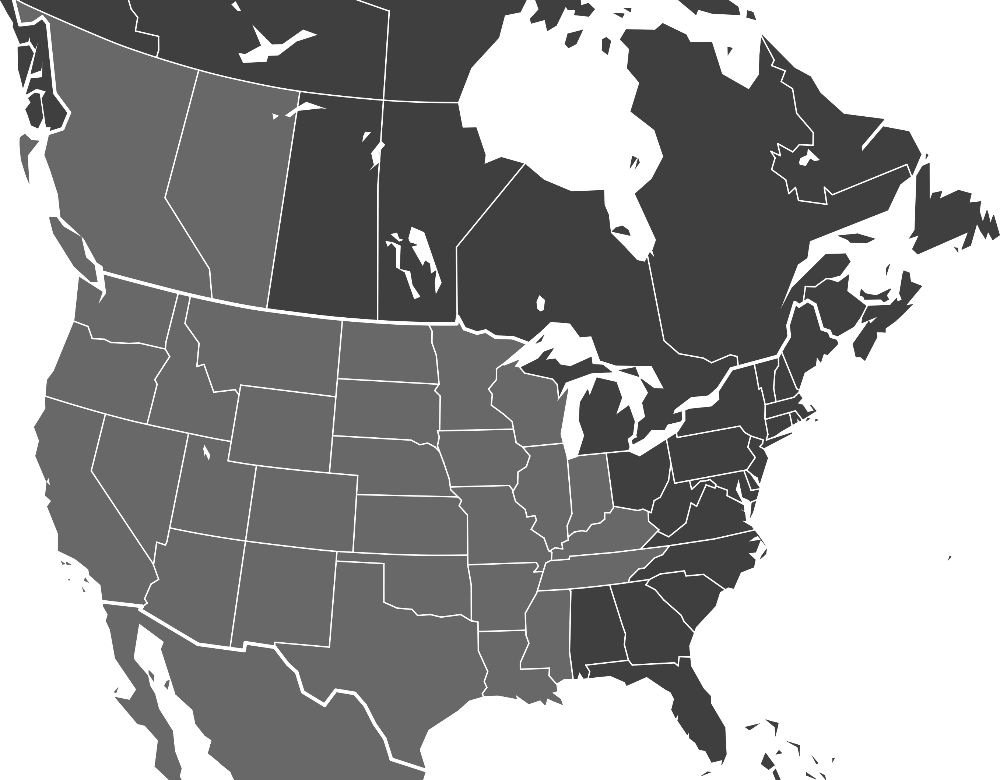
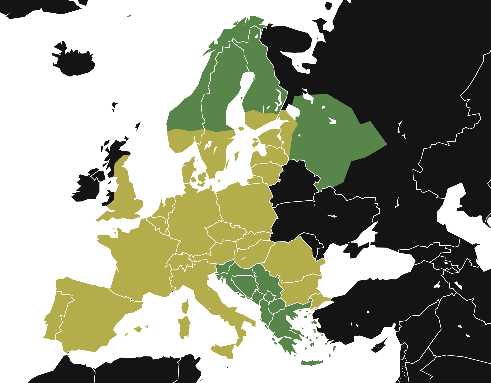

# Spooks' TruckSim Repository

- Hello! This website is provided to better streamline and organize all of the maps I've made over the years in one place! Given more and more projects are running simultaneously, I wouldn't be able to keep up linking map after map on the SCS forum for long before running out of available links. This also gives me a place to localize a bunch of other information I like to look at including the mileage targets.

- The website is laid out to where you click below on a state/country equivalent and within contains any maps I've made through the course of its development. Mileage targets for that state are also included. Where a bundled map expansion exists, all associated states/regions of states will be bundled together (currently only valid for ETS2 expansions). Thanks for visiting! I hope the information you find here can be helpful for any and all discussions.

- Want further explanation regarding how the maps and mileage targets can be interpreted or found? [Click here!](interpretation.md)

- This website is updated for version **<mark>v1.60 OB</mark>** released on June 2nd (ATS) and June 4th (ETS2).

**<mark>[Check out the changelog here for the most recent updates!](changelog.md)</mark>**

# American Truck Simulator

## ATS Interactive Map
<!-- MI: 1477,908,1503,947,1482,977,1508,974,1521,990,1547,994,1606,968,1608,988,1637,990,1661,1010,1674,1038,1689,1080,1673,1125,1707,1100,1723,1145,1719,1180,1704,1193,1709,1214,1705,1222,1569,1235,1585,1183,1571,1141,1574,1092,1594,1057,1570,1026,1535,1039,1518,1076,1514,1043,1501,1028,1425,1011,1414,997,1455,932
OH: 1648,1232,1706,1226,1736,1239,1807,1194,1820,1260,1813,1304,1791,1348,1774,1358,1766,1389,1745,1380,1731,1384,1667,1373
WV: 1762,1392,1768,1395,1777,1361,1794,1352,1817,1305,1822,1269,1830,1315,1870,1307,1876,1332,1903,1308,1915,1308,1926,1304,1941,1317,1939,1322,1916,1314,1890,1372,1875,1364,1860,1419,1815,1456,1788,1442,1791,1438,1763,1415 -->
- Use the interactive map below to select a state or province. 
- The officially announced maps are [British Columbia](ats/britishcolumbia.md), [Indiana](ats/indiana.md), and [South Dakota](ats/southdakota.md). 

  
  

  <svg class="map-overlay"
     viewBox="0 0 2715 2119"
     preserveAspectRatio="xMidYMid meet">
     <a href="#/ats/alberta">
          <polygon class="state" data-name="Alberta" data-type="mileage" data-flags="ab"
               points="541,193,628,215,716,233,811,250,722,836,650,824,577,809,570,730,450,536">
          </polygon>
     </a>
     <a href="#/ats/arizona">
          <polygon class="state" data-name="Arizona" data-type="mileage" data-flags="az"
               points="462,1436,558,1455,663,1471,623,1756,538,1744,387,1654,391,1647,402,1638,394,1626,412,1588,433,1574,419,1534,427,1475,449,1483,456,1469">
          </polygon>
     </a>
     <a href="#/ats/arkansas">
          <polygon class="state" data-name="Arkansas" data-type="both" data-flags="ar"
               points="1273,1536,1454,1530,1459,1537,1447,1552,1448,1556,1471,1555,1455,1607,1423,1664,1425,1709,1300,1713,1300,1688,1282,1684,1282,1591">
          </polygon>
     </a>
     <a href="#/ats/britishcolumbia">
          <polygon class="state" data-name="British Columbia" data-type="both" data-flags="bc"
               points="42,0,176,62,319,122,424,158,537,191,445,537,567,732,573,808,485,788,376,760,280,734,260,739,264,766,246,766,200,724,144,634,133,592,135,589,154,590,164,589,157,529,147,498,79,498,56,433,53,391,54,373,67,363,85,380,105,382,133,367,173,353,194,305,154,251,134,62,116,41,112,41,89,57,57,61">
          </polygon>
     </a>
     <a href="#/ats/california">
          <polygon class="state" data-name="California" data-type="mileage" data-flags="ca"
               points="123,1078,283,1126,245,1278,414,1534,428,1573,408,1585,390,1626,397,1637,390,1642,223,1623,157,1559,157,1449,127,1376,138,1360,122,1345,127,1310,135,1317,132,1297,126,1308,95,1238,105,1197,92,1160,123,1109,122,1087">
          </polygon>
     </a>
     <a href="#/ats/colorado">
          <polygon class="state" data-name="Colorado" data-type="mileage" data-flags="co"
               points="698,1266,791,1277,968,1293,956,1497,915,1495,793,1483,669,1467">
          </polygon>
     </a>
     <a href="#/ats/idaho">
          <polygon class="state" data-name="Idaho" data-type="mileage" data-flags="id"
               points="485,799,514,806,499,878,538,934,532,997,552,992,579,1067,637,1060,646,1073,626,1196,512,1175,402,1151,429,1044,422,1031,463,969,451,947,452,930">
          </polygon>
     </a>
     <a href="#/ats/illinois">
          <polygon class="state" data-name="Illinois" data-type="both" data-flags="il"
               points="1423,1216,1528,1206,1537,1242,1550,1394,1537,1427,1539,1465,1522,1474,1524,1488,1505,1485,1491,1494,1479,1460,1445,1437,1459,1413,1453,1398,1432,1401,1428,1382,1401,1360,1394,1336,1408,1313,1408,1284,1431,1269,1441,1238">
          </polygon>
     </a>
     <a href="#/ats/indiana">
          <polygon class="state" data-name="Indiana" data-type="map" data-flags="in"
               points="1543,1250,1569,1240,1643,1233,1663,1377,1654,1390,1639,1390,1638,1409,1627,1418,1604,1422,1590,1441,1580,1438,1558,1442,1544,1454,1542,1428,1555,1396">
          </polygon>
     </a>
     <a href="#/ats/iowa">
          <polygon class="state" data-name="Iowa" data-type="both" data-flags="ia"
               points="1191,1172,1392,1168,1399,1204,1417,1216,1435,1239,1427,1265,1404,1280,1403,1311,1393,1328,1383,1316,1224,1320,1222,1300,1190,1210,1195,1187">
          </polygon>
     </a>
     <a href="#/ats/kansas">
          <polygon class="state" data-name="Kansas" data-type="both" data-flags="ks"
               points="970,1346,1242,1352,1250,1360,1244,1373,1266,1399,1267,1505,1113,1505,961,1498">
          </polygon>
     </a>
     <a href="#/ats/kentucky">
          <polygon class="state" data-name="Kentucky" data-type="both" data-flags="ky"
               points="1668,1378,1731,1389,1745,1385,1757,1391,1758,1417,1785,1439,1737,1489,1545,1509,1543,1516,1499,1520,1500,1498,1497,1497,1507,1490,1527,1494,1530,1492,1527,1476,1545,1468,1544,1460,1560,1447,1579,1444,1591,1446,1607,1427,1630,1423,1644,1411,1644,1395,1657,1395,1668,1378">
          </polygon>
     </a>
     <a href="#/ats/louisiana">
          <polygon class="state" data-name="Louisiana" data-type="both" data-flags="la"
               points="1300,1718,1425,1714,1425,1727,1433,1747,1410,1798,1410,1820,1489,1817,1487,1835,1510,1862,1512,1877,1499,1881,1522,1899,1527,1914,1486,1896,1479,1915,1466,1901,1435,1912,1399,1887,1402,1898,1349,1889,1314,1890,1312,1884,1324,1867,1317,1851,1326,1823,1301,1768">
          </polygon>
     </a>
     <a href="#/ats/mexico">
          <polygon class="state" data-name="Mexico" data-type="mileage" data-flags="mx"
               points="279,1640,376,1651,374,1656,375,1658,535,1754,663,1772,667,1769,670,1752,743,1763,777,1807,801,1828,817,1881,879,1920,882,1920,914,1880,960,1888,986,1918,1012,1968,1040,2008,1058,2066,1155,2098,1149,2118,635,2119,624,2096,563,2046,573,2011,555,1998,530,1966,522,1928,476,1886,420,1884,432,1926,469,1985,476,2042,493,2087,488,2109,493,2118,458,2118,419,2082,428,2011,393,1971,372,1966,268,1843,361,1861,312,1788,298,1711,286,1686,292,1669,280,1648">
          </polygon>
     </a>
     <a href="#/ats/minnesota">
          <polygon class="state" data-name="Minnesota" data-type="both" data-flags="mn"
               points="1168,885,1241,885,1245,881,1245,876,1257,897,1295,910,1317,905,1343,921,1390,922,1425,935,1365,986,1345,999,1345,1030,1323,1056,1334,1072,1330,1100,1369,1130,1388,1147,1391,1163,1196,1167,1197,1074,1183,1060,1194,1044,1187,965,1175,931,1175,898">
          </polygon>
     </a>
     <a href="#/ats/mississippi">
          <polygon class="state" data-name="Mississippi" data-type="map" data-flags="ms"
               points="1460,1607,1543,1603,1547,1608,1543,1770,1553,1843,1530,1844,1512,1855,1493,1834,1494,1812,1415,1815,1415,1800,1438,1747,1430,1722,1428,1666,1459,1612">
          </polygon>
     </a>
     <a href="#/ats/missouri">
          <polygon class="state" data-name="Missouri" data-type="both" data-flags="mo"
               points="1225,1325,1381,1321,1390,1333,1389,1335,1396,1362,1423,1385,1429,1407,1450,1403,1453,1412,1439,1438,1475,1464,1487,1497,1495,1502,1494,1520,1479,1528,1472,1550,1454,1551,1464,1538,1456,1525,1272,1531,1271,1397,1249,1373,1255,1359,1226,1329">
          </polygon>
     </a>
     <a href="#/ats/montana">
          <polygon class="state" data-name="Montana" data-type="mileage" data-flags="mt"
               points="518,807,615,828,722,847,926,872,909,1075,651,1043,647,1067,638,1055,582,1063,554,986,537,992,543,932,504,877">
          </polygon>
     </a>
     <a href="#/ats/nebraska">
          <polygon class="state" data-name="Nebraska" data-type="both" data-flags="ne"
               points="905,1186,1115,1198,1139,1211,1159,1206,1178,1215,1191,1228,1217,1304,1221,1331,1237,1347,970,1341,973,1289,897,1282">
          </polygon>
     </a>
     <a href="#/ats/nevada">
          <polygon class="state" data-name="Nevada" data-type="mileage" data-flags="nv"
               points="287,1127,398,1154,509,1178,451,1467,447,1477,423,1469,415,1527,250,1278">
          </polygon>
     </a>
     <a href="#/ats/newmexico">
          <polygon class="state" data-name="New Mexico" data-type="mileage" data-flags="nm"
               points="668,1472,793,1487,912,1499,892,1755,743,1742,743,1752,664,1740,661,1743,658,1761,627,1757">
          </polygon>
     </a>
     <a href="#/ats/northdakota">
          <polygon class="state" data-name="North Dakota" data-type="both" data-flags="nd"
               points="931,872,1024,879,1162,884,1170,900,1170,931,1182,965,1189,1041,918,1026">
          </polygon>
     </a>
     <a href="#/ats/oklahoma">
          <polygon class="state" data-name="Oklahoma" data-type="both" data-flags="ok"
               points="917,1500,1113,1510,1267,1510,1267,1535,1276,1588,1277,1682,1250,1666,1198,1673,1168,1666,1134,1669,1119,1652,1079,1649,1044,1634,1044,1528,915,1522">
          </polygon>
     </a>
     <a href="#/ats/oregon">
          <polygon class="state" data-name="Oregon" data-type="mileage" data-flags="or"
               points="200,875,236,888,249,922,281,923,301,933,350,935,377,934,447,950,458,968,418,1030,424,1043,397,1150,286,1122,123,1074,127,1031,145,1007">
          </polygon>
     </a>
     <a href="#/ats/southdakota">
          <polygon class="state" data-name="South Dakota" data-type="both" data-flags="sd"
               points="918,1031,1187,1046,1177,1061,1192,1076,1191,1167,1184,1167,1189,1187,1184,1210,1187,1217,1182,1212,1160,1201,1140,1205,1115,1192,905,1181">
          </polygon>
     </a>
     <a href="#/ats/tennessee">
          <polygon class="state" data-name="Tennessee" data-type="both" data-flags="tn"
               points="1549,1513,1812,1485,1797,1504,1774,1513,1749,1540,1733,1543,1707,1569,1704,1580,1654,1586,1546,1597,1461,1602,1483,1531,1495,1525,1547,1521">
          </polygon>
     </a>
     <a href="#/ats/texas">
          <polygon class="state" data-name="Texas" data-type="mileage" data-flags="tx"
               points="914,1526,1039,1533,1039,1636,1075,1653,1117,1657,1132,1674,1166,1671,1197,1679,1249,1671,1278,1689,1295,1691,1295,1767,1321,1824,1312,1851,1318,1867,1307,1883,1309,1892,1273,1903,1245,1929,1162,1984,1139,2037,1154,2086,1067,2058,1050,2005,1022,1965,996,1913,966,1878,909,1869,879,1908,827,1876,810,1823,784,1799,749,1753,748,1747,896,1760">
          </polygon>
     </a>
     <a href="#/ats/utah">
          <polygon class="state" data-name="Utah" data-type="mileage" data-flags="ut"
               points="513,1179,625,1201,616,1253,693,1265,664,1466,558,1450,463,1432">
          </polygon>
     </a>
     <a href="#/ats/washington">
          <polygon class="state" data-name="Washington" data-type="mileage" data-flags="wa"
               points="282,746,481,798,447,930,447,945,380,929,351,930,305,928,284,919,252,917,241,885,202,870,214,752,278,793,268,824,288,796">
          </polygon>
     </a>
     <a href="#/ats/wisconsin">
          <polygon class="state" data-name="Wisconsin" data-type="map" data-flags="wi"
               points="1408,978,1397,995,1408,998,1422,1015,1499,1032,1510,1045,1515,1083,1511,1091,1542,1055,1521,1179,1527,1201,1420,1212,1402,1200,1393,1146,1365,1120,1336,1099,1339,1070,1329,1057,1350,1032,1350,1003,1365,992,1369,993">
          </polygon>
     </a>
     <a href="#/ats/wyoming">
          <polygon class="state" data-name="Wyoming" data-type="mileage" data-flags="wy"
               points="655,1048,909,1080,892,1282,791,1272,697,1261,621,1250">
          </polygon>
     </a>
  </svg>

<!-- state-nav: ats -->

## Large Maps

?> **Note,** It is recommended to `Open Image in New Tab` to be able to fully zoom into the maps.

  🇨🇦 Canada (Western) Complete Map

  
  
  
  🇺🇸 United States Complete Map

# Euro Truck Simulator 2

## ETS2 Interactive Map
<!-- ETS2 Interactive Map -->
<!-- IS: 348,225,359,235,370,268,359,282,360,301,377,286,383,294,398,269,403,294,412,281,429,278,435,302,439,286,448,297,477,296,481,281,492,283,499,305,518,298,503,315,513,320,504,334,526,353,520,377,492,400,426,419,407,415,386,425,343,404,328,377,293,363,295,345,301,358,314,354,322,320,286,306,288,294,339,306,327,296,346,286,297,260,333,234,345,258,341,232 -->
- Use the interactive map below to select a country/bundle of countries. 
- The officially announced maps are Iceland, Ireland, and Soul of Anatolia. 
- An ongoing rework has been confirmed for [the United Kingdom](ets2/ets2base.md?id=🇬🇧-united-kingdom).
- ETS2 maps on this website are represented as their respective DLCs. Countries spanning multiple DLCs will have their mileage targets shown in both DLC subpages (CZ, FI, FR, IT, NO, PL, RU, SK, SE).

  
  

  <svg class="map-overlay"
     viewBox="0 0 2715 2119"
     preserveAspectRatio="xMidYMid meet">
    <a href="#/ets2/ets2base">
          <polygon class="state" data-name="Base Map" data-type="mileage" data-flags="aut bel cze fra deu ita lux ned pol svk sui gbr"
               points="683,856,715,859,866,991,1053,1021,1065,1039,1086,1045,1096,1042,1087,1067,1148,1042,1156,1042,1162,1024,1174,1032,1169,1054,1185,1059,1185,1070,1293,1104,1305,1235,1293,1246,1297,1254,1289,1259,1288,1265,1313,1323,1325,1325,1333,1351,1321,1370,1308,1373,1311,1387,1295,1386,1297,1425,1288,1434,1249,1448,1231,1462,1197,1457,1183,1474,1194,1484,1194,1499,1197,1505,1194,1504,1193,1502,1145,1525,1157,1545,1059,1537,990,1562,941,1547,937,1537,873,1523,833,1485,829,1413,759,1344,767,1258,729,1216,681,1206,649,1214,620,1201,594,1225,568,1212,543,1227,526,1218,545,1208,587,1167,623,1173,638,1163,614,1164,589,1139,629,1107,629,1063,639,1064,658,1018,649,1020,640,1000,653,977,627,980,634,903">
          </polygon>
     </a>
     <a href="#/ets2/goingeast">
          <polygon class="state" data-name="Going East!" data-type="mileage" data-flags="cze hun pol svk"
               points="1196,1064,1254,1040,1264,1025,1318,1006,1334,1027,1356,1027,1361,1023,1455,1013,1476,1019,1507,1088,1493,1097,1485,1121,1506,1126,1500,1143,1535,1205,1525,1208,1495,1262,1503,1289,1498,1287,1487,1328,1491,1333,1515,1342,1513,1354,1497,1363,1470,1430,1459,1448,1415,1459,1376,1485,1336,1481,1301,1450,1292,1436,1301,1427,1299,1391,1316,1393,1313,1378,1320,1376,1321,1371,1332,1351,1325,1325,1313,1323,1288,1265,1289,1259,1297,1254,1293,1246,1305,1235,1293,1104,1200,1075">
          </polygon>
     </a>
     <a href="#/ets2/scandinavia">
          <polygon class="state" data-name="Scandinavia" data-type="mileage" data-flags="den nor swe"
               points="924,727,974,711,1054,727,1129,713,1190,731,1294,718,1303,746,1281,762,1254,766,1298,768,1323,836,1315,856,1317,867,1299,895,1249,943,1233,947,1199,948,1188,965,1191,979,1217,998,1216,1008,1136,1011,1120,1035,1090,1025,1049,1016,1015,1011,1003,937,1008,926,1036,911,1009,919,968,846,936,813,935,792,929,775">
          </polygon>
     </a>
     <a href="#/ets2/france">
          <polygon class="state" data-name="Vive la France!" data-type="mileage" data-flags="fra"
               points="767,1259,759,1345,829,1414,833,1486,873,1524,932,1535,937,1551,944,1554,939,1566,947,1589,968,1592,963,1603,971,1610,964,1612,957,1608,950,1609,948,1616,1038,1653,1042,1697,1029,1739,1011,1730,1003,1701,911,1646,852,1628,826,1616,790,1634,785,1665,744,1668,736,1655,715,1647,691,1636,690,1644,632,1623,602,1594,611,1592,644,1486,656,1510,654,1492,642,1471,646,1448,618,1414,610,1378,548,1344,536,1331,550,1328,537,1316,543,1300,599,1300,614,1319,640,1315,659,1320,652,1312,648,1261,670,1267,673,1283,714,1291,721,1273">
          </polygon>
     </a>
     <a href="#/ets2/italy">
          <polygon class="state" data-name="Italia" data-type="mileage" data-flags="ita"
               points="950,1551,990,1562,1059,1537,1156,1545,1144,1552,1146,1578,1200,1621,1227,1674,1264,1703,1301,1698,1310,1703,1299,1724,1345,1743,1412,1779,1412,1808,1396,1805,1386,1787,1348,1775,1333,1817,1359,1833,1362,1859,1342,1862,1340,1888,1314,1918,1299,1909,1295,1910,1281,1945,1291,1967,1285,1988,1259,1985,1245,1970,1228,1971,1183,1947,1166,1936,1039,1867,1027,1856,1019,1861,1015,1876,1001,1874,992,1855,995,1797,984,1780,987,1763,1006,1769,1019,1754,1034,1749,1081,1655,1070,1607,1012,1576,986,1605,976,1608,969,1602,974,1589,950,1585,944,1567">
          </polygon>
     </a>
     <a href="#/ets2/balticsea">
          <polygon class="state" data-name="Beyond the Baltic Sea" data-type="mileage" data-flags="est fin lat lit rus"
               points="1353,622,1400,607,1456,628,1508,626,1539,634,1551,609,1577,609,1625,664,1634,664,1648,688,1618,738,1596,884,1592,885,1580,908,1553,917,1562,943,1543,960,1538,994,1547,997,1545,1004,1536,998,1518,1018,1484,1028,1479,1016,1456,1009,1366,1019,1377,1009,1365,1009,1366,995,1402,984,1382,907,1396,847,1405,815,1396,810,1394,797,1409,787,1410,785,1407,777,1394,772,1410,762,1426,757,1410,720,1389,712,1347,717,1329,724,1317,713,1321,703,1357,688,1355,627">
          </polygon>
     </a>
     <a href="#/ets2/blacksea">
          <polygon class="state" data-name="Road to the Black Sea" data-type="mileage" data-flags="bul rou tur"
               points="1519,1347,1528,1341,1577,1340,1594,1349,1604,1337,1630,1329,1649,1306,1659,1310,1679,1337,1722,1378,1723,1415,1748,1448,1783,1430,1796,1441,1800,1455,1780,1467,1774,1461,1768,1495,1782,1538,1759,1548,1759,1582,1748,1597,1766,1610,1787,1641,1832,1651,1826,1664,1801,1666,1783,1674,1719,1737,1704,1740,1713,1729,1716,1707,1724,1691,1722,1674,1732,1665,1724,1650,1703,1654,1707,1669,1677,1683,1642,1671,1627,1678,1582,1693,1583,1676,1554,1649,1558,1635,1553,1619,1570,1601,1541,1573,1548,1546,1540,1537,1552,1530,1534,1518,1522,1532,1494,1522,1493,1501,1469,1493,1460,1475,1440,1458,1462,1454,1476,1430,1501,1365,1518,1357">
          </polygon>
     </a>
     <a href="#/ets2/iberia">
          <polygon class="state" data-name="Iberia" data-type="mileage" data-flags="por esp"
               points="373,1531,400,1547,509,1578,526,1578,552,1588,573,1586,584,1597,597,1595,629,1627,694,1649,695,1642,717,1653,717,1669,736,1663,742,1673,787,1670,793,1681,784,1684,786,1701,815,1801,820,1816,785,1819,770,1841,755,1835,753,1825,745,1827,706,1848,693,1858,687,1854,647,1853,606,1881,594,1911,560,1915,529,1946,499,1944,438,1933,417,1940,395,1938,386,1947,379,1944,373,1950,376,1956,372,1959,350,1940,341,1896,316,1880,279,1882,266,1873,237,1872,253,1847,265,1791,247,1795,254,1781,261,1776,241,1778,256,1746,277,1729,304,1655,313,1598,309,1553,326,1542,347,1544">
          </polygon>
     </a>
     <a href="#/ets2/heart-of-russia">
          <polygon class="state" data-name="Heart of Russia" data-type="both" data-flags="rus"
               points="1628,534,1675,527,1713,525,1809,521,1945,601,1992,689,2046,670,2140,800,2023,870,1942,893,1898,1008,1839,1038,1825,1027,1797,1040,1779,1042,1776,1060,1765,1060,1737,1021,1746,1009,1759,1014,1775,987,1755,969,1739,974,1739,961,1695,931,1685,888,1655,882,1640,892,1629,881,1597,884,1599,872,1618,738,1648,688,1634,664,1635,645,1653,646,1661,619,1653,603,1614,583">
          </polygon>
     </a>
     <a href="#/ets2/west-balkans">
          <polygon class="state" data-name="West Balkans" data-type="both" data-flags="alb bos hrv kos mne mkd srb slo"
               points="1199,1463,1231,1467,1251,1453,1289,1439,1298,1454,1334,1485,1377,1490,1417,1464,1435,1459,1458,1479,1466,1498,1489,1504,1490,1525,1523,1537,1535,1523,1544,1529,1533,1536,1543,1548,1536,1574,1564,1601,1548,1618,1552,1635,1549,1650,1578,1677,1577,1695,1575,1696,1571,1708,1552,1709,1537,1724,1506,1735,1509,1743,1501,1773,1487,1783,1489,1793,1480,1806,1470,1791,1446,1778,1437,1764,1451,1772,1442,1756,1446,1730,1436,1716,1444,1692,1436,1692,1381,1655,1324,1643,1317,1631,1310,1623,1297,1616,1250,1567,1229,1566,1209,1553,1191,1514,1193,1509,1201,1511,1204,1509,1198,1498,1198,1483,1189,1475">
          </polygon>
     </a>
          <a href="#/ets2/greece">
          <polygon class="state" data-name="Greece" data-type="both" data-flags="gre"
               points="1470,1796,1477,1810,1483,1810,1494,1795,1492,1785,1504,1777,1514,1742,1510,1739,1539,1729,1554,1714,1575,1713,1578,1699,1630,1682,1642,1676,1676,1688,1712,1671,1709,1657,1721,1655,1726,1664,1717,1672,1719,1689,1712,1704,1703,1722,1696,1728,1695,1746,1696,1759,1721,1786,1739,1772,1755,1788,1747,1795,1743,1819,1744,1840,1781,1850,1793,1854,1797,1902,1813,1895,1821,1911,1846,1918,1859,1912,1846,1945,1829,1970,1822,1977,1787,1993,1785,2007,1717,2025,1711,2019,1668,2021,1665,2006,1630,1975,1606,1965,1586,1935,1580,1935,1582,1955,1558,1913,1537,1897,1525,1908,1514,1898,1500,1881,1509,1868,1508,1859,1508,1845,1481,1821,1461,1804">
          </polygon>
     </a>
     <a href="#/ets2/nordic-horizons">
          <polygon class="state" data-name="Nordic Horizons" data-type="both" data-flags="fin nor swe"
               points="1383,89,1407,88,1460,110,1444,132,1424,135,1468,143,1470,154,1454,150,1433,224,1447,245,1478,264,1468,310,1511,370,1515,419,1543,455,1538,474,1587,509,1583,535,1537,634,1508,626,1456,628,1400,607,1353,622,1337,579,1331,542,1340,538,1349,540,1403,443,1397,433,1411,427,1404,402,1372,396,1344,404,1323,465,1334,483,1317,518,1262,577,1250,613,1250,689,1293,718,1190,731,1129,713,1054,727,974,711,924,727,920,685,938,620,992,578,1016,550,1057,526,1095,471,1119,402,1158,328,1168,292,1199,271,1145,292,1116,313,1142,281,1167,267,1150,261,1185,223,1183,247,1207,243,1200,218,1217,201,1236,163,1281,159,1301,145,1287,134,1315,116,1320,123,1361,92,1350,147,1370,96,1376,128">
          </polygon>
     </a>
  </svg>

<!-- state-nav: ets2 -->