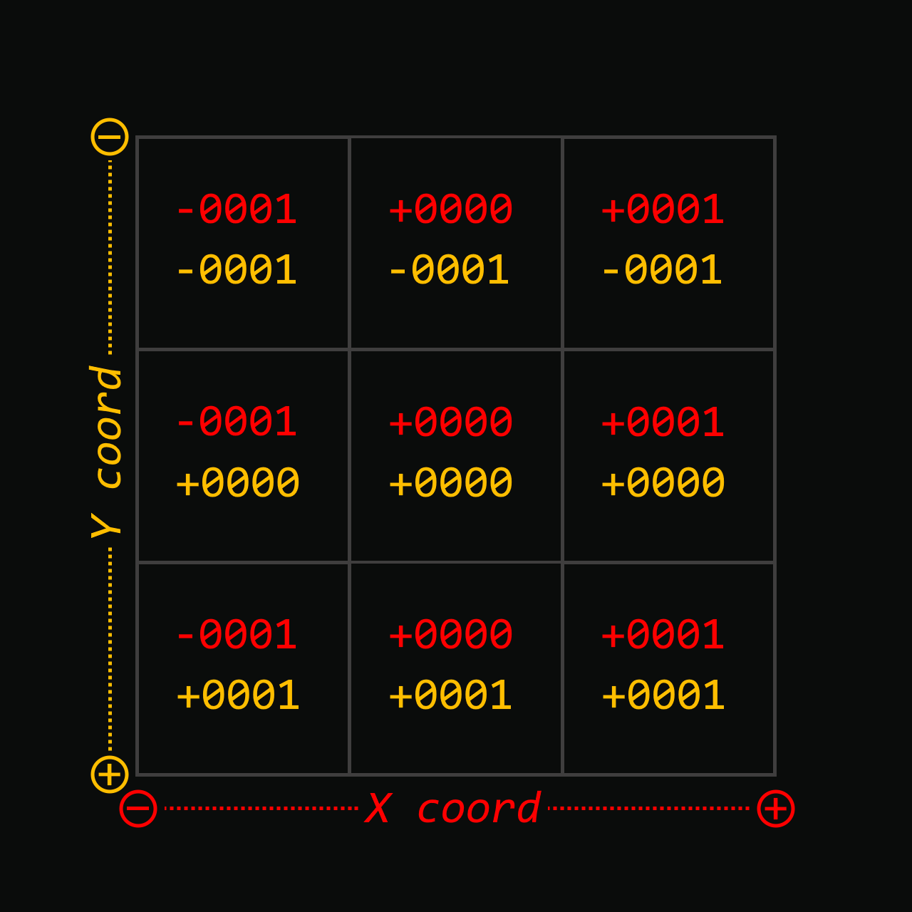
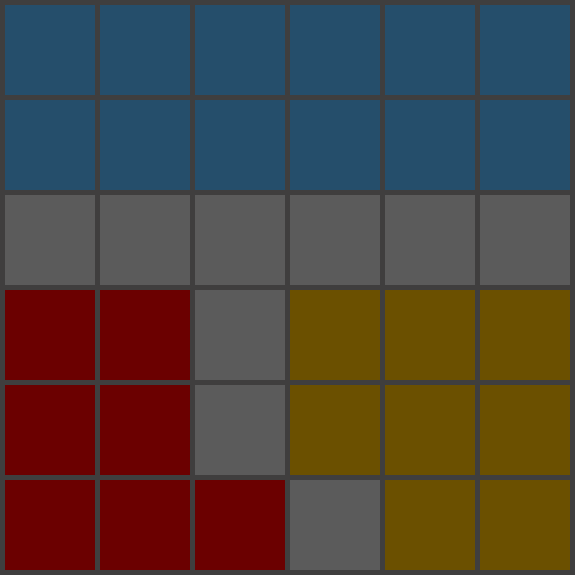
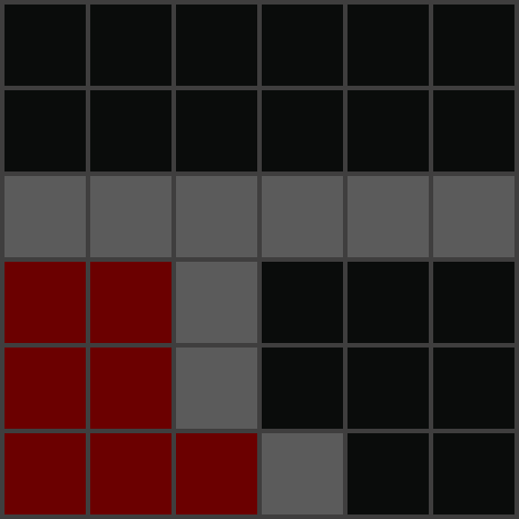
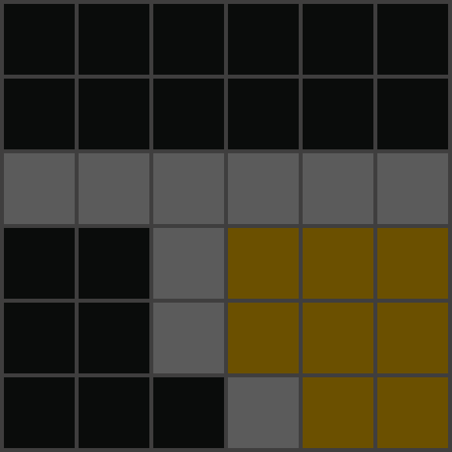
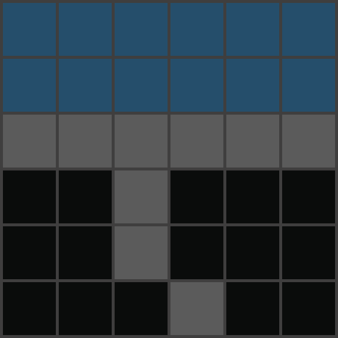
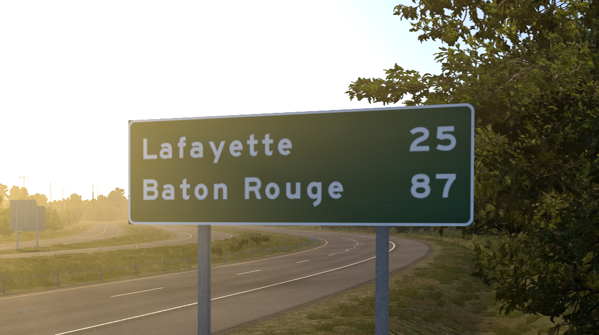
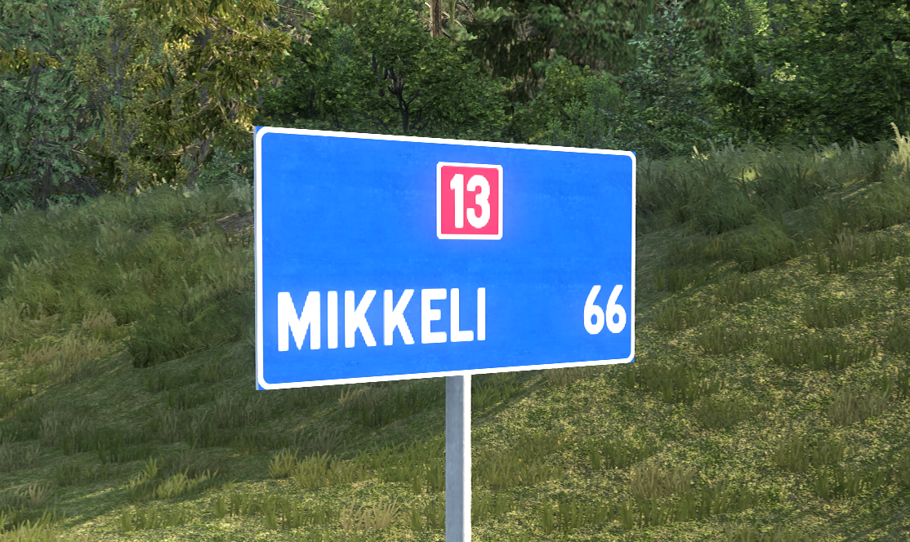

# Questions
- [What is a sector?](#what-is-a-sector)
- [Which sectors can I see?](#which-sectors-can-i-see)
- [How can I view upcoming sectors?](#how-can-i-view-upcoming-sectors)
- [How do I enable the developer console?](#how-do-i-enable-the-developer-console)
- [How do I launch the map editor?](#how-do-i-launch-the-map-editor)
- [What are mileage targets?](#what-are-mileage-targets)
- [How can I view mileage targets?](#how-can-i-view-mileage-targets)
- [Other](#other-questions)

## What is a sector?
Both American Truck Simulator and Euro Truck Simulator 2 divide their map into a grid of sectors. These are written in the editor in the format of ```sec+0000+0000``` wherein the first series is the **x coordinate** and the second the **y coordinate**. The x direction is intuitive relative to a common coordinate system however the y direction is the opposite: the further north on the map you go the lower the corresponding y value.

In the example below, the center-left box would be ```sec-0001+0000```.



In all maps I make, I show the sector boundaries and coordinate system (true to varying degrees of my very first few maps) to help show what areas will and won't appear prior to a DLC's full release.

## Which sectors can I see?
Each DLC contains its own sectors that only are revealed when purchasing the DLC. However, all sectors containing two or more DLCs are part of the base map file rather than one or all of the DLCs of that sector itself. This would mean for those who don't own both of two DLCs that border one another, those bordering sectors would still be visible within the map editor (and devcam in-game).

In previous updates of map releases, these base map sectors would be visible in the few patches just before release. However, this is unlikely to continue into the future as Missouri didn't bring any sectors on its border with Iowa, a map that would release in the next update. The last instance of this occurring would be along the Kansas-Nebraska border prior to Kansas' official release. 

&nbsp;

<figure style="text-align: center;">
  
  <figcaption>
    Ownership of 
    <span style="color: #c0392b; font-weight: bold">DLC 1</span>, 
    <span style="color: #f1c40f; font-weight: bold">DLC 2</span>, &amp; 
    <span style="color: #3498db; font-weight: bold">DLC 3</span>
  </figcaption>
</figure>
&ensp;

<div style="display: flex; gap: 1rem; justify-content: center;">

  <figure style="text-align: center;">
    
    <figcaption>Ownership of only
    <span style="color: #c0392b; font-weight: bold">DLC 1</span></figcaption>
  </figure>

  <figure style="text-align: center;">
    
    <figcaption>Ownership of only
    <span style="color: #f1c40f; font-weight: bold">DLC 2</span></figcaption>
  </figure>

  <figure style="text-align: center;">
    
    <figcaption>Ownership of only
    <span style="color: #3498db; font-weight: bold">DLC 3</span></figcaption>
  </figure>

</div>

## How can I view upcoming sectors?
In the versions leading up to a map release, or sometimes only the version of release itself, the bordering sectors of a future map DLC will be updated and developed as changes are pushed to the map. To be able to view these, you should and can access out-of-bounds locations either in-game or in the map editor. With the former, press ````0```` (developer console enabled) and navigate using the NumPad keys. With the latter, open the map via ````File > Open > usa.mbd OR europe.mbd```` and navigate around. Use ````c```` to enter a free roam view and navigate using WASD.

## How do I enable the developer console?
First go to your ````Documents```` folder on whichever computer drive contains ATS/ETS2.

````Documents > American Truck Simulator/Euro Truck Simulator 2 > config.cfg````

Open ````config.cfg```` in a text editing software like Notepad or Notepad++. Find the lines for ````g_developer```` and ````g_console```` and set these values from ````0```` to ````1````.

## How do I launch the map editor?
Right click the game in your Steam library and navigate to ````Properties````. In the ````General```` tab, at the bottom is a section for ````Selected Launch Option````.

Add the tag ````-edit```` and then launch the game. If you have mods and want to use the map editor without any, also add the ````-noworkshop```` and ````-pure```` options.

You can also create a shortcut for this elsewhere on your computer. Create the shortcut from the Steam folder and add the same tags from above accordingly by going to ````Properties```` and editing ````Target````. Examples of target paths can be listed as follows, depending on your machine:

````
"C:\Program Files (x86)\Steam\steamapps\common\American Truck Simulator\bin\win_x64\amtrucks.exe" -edit
"C:\Program Files (x86)\Steam\steamapps\common\Euro Truck Simulator 2\bin\win_x64\eurotrucks2.exe" -edit -noworkshop -pure
````

Sometimes you are prompted with assurance you'd like to launch with those options. Pressing Continue will launch the game in the editor if you have the ````-edit```` option loaded.

## What are mileage targets?
Mileage targets are how the games automatically calculate the distance from your location to somewhere else on the map; adding to realism but without making implementation a headache. A common misconception is that they denote all **marked** cities on the map which isn't at all true. Marked cities are included but so are scenic cities, road junctions, and administrative borders. With very few exceptions (i.e. Ashland, KS in ATS or Å i Lofoten, NO in ETS2) mileage targets are almost always accessible in the actual DLC, however. This also excludes future DLC targets where the DLC isn't made yet.

TL;DR you can use mileage targets as a pretty safe estimation of what places will and won't make a DLC but always be aware rare exceptions can exist.

<div style="display: flex; gap: 0.5rem; justify-content: center;">

  <figure style="text-align: center;">
    
  </figure>

  <figure style="text-align: center;">
    
  </figure>

</div>

Mileage targets are added over the course of usually no more than 3 updates leading up to that DLC's release. The proportion of new mileage targets added by number of updates to release also is inconsistent but in broad strokes they're added over 2 updates of the version prior and version of that DLC.

## How can I view mileage targets?
Go to the map editor; you do not need to launch the map .mbd file. Go to ````View > Mileage Target List```` and the list will load!

## Other questions?
I'd be happy to answer other questions about this to the best of my knowledge. Send me a message on the [SCS Forum](https://forum.scssoft.com/memberlist.php?mode=viewprofile&u=222458)! I'll be the first to admit I'm not insanely knowledgeable when it comes to coding and backend tech, but I certainly do try.